# Procesverslag
**Auteur:** -jouw naam-

Markdown cheat cheet: [Hulp bij het schrijven van Markdown](https://github.com/adam-p/markdown-here/wiki/Markdown-Cheatsheet). Nb. de standaardstructuur en de spartaanse opmaak zijn helemaal prima. Het gaat om de inhoud van je procesverslag. Besteedt de tijd voor pracht en praal aan je website.

## Bronnenlijst
1. -bron 1-
2. -bron 2-
3. -...-

## Herkansing resultaat screenshots:

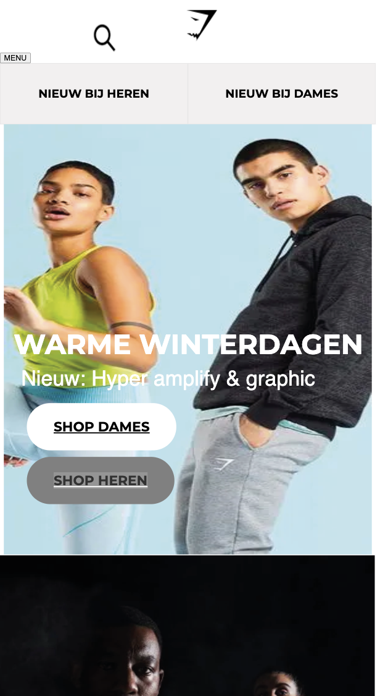
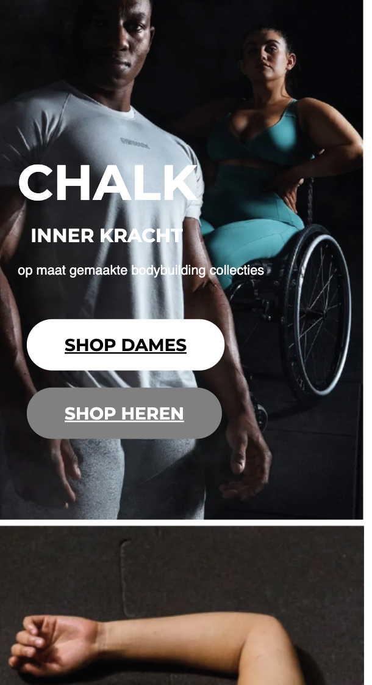
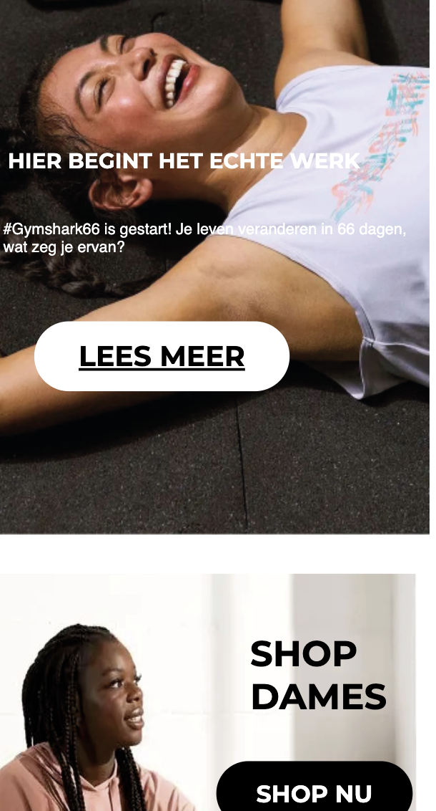
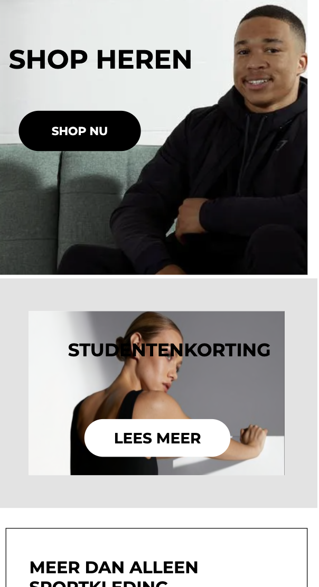
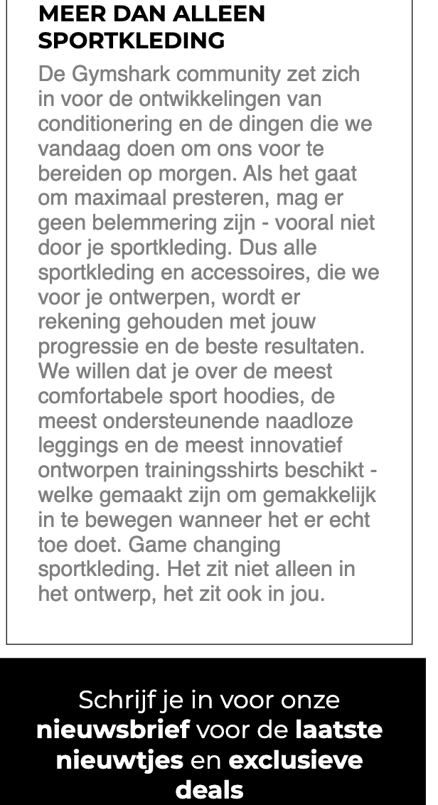
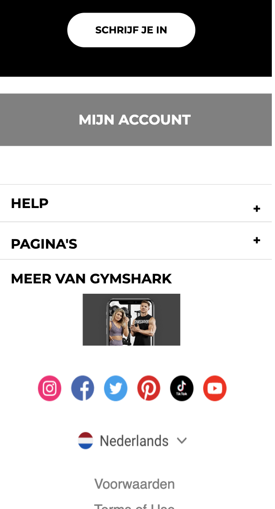
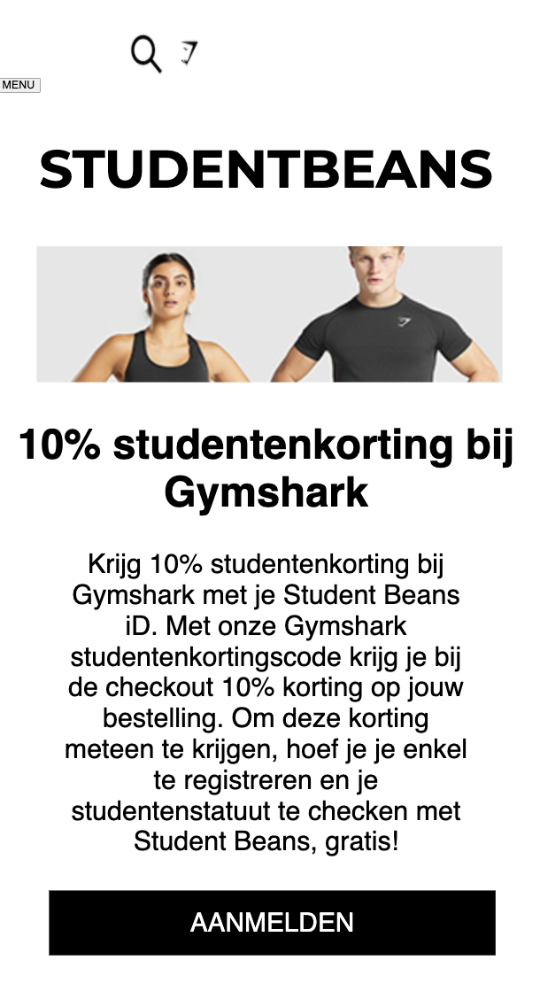
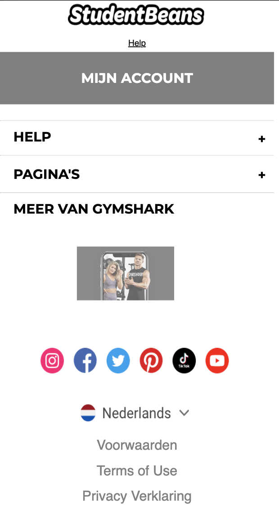

## Eindgesprek (week 7/8)

Het ging heel stroef. Hamburgermenu nog steeds niet gelukt helaas. Ik ben uiteindelijk wel blij met me eindresultaat want ik heb er echt mega lang aangezeten en sinds de kerstvakantie pas begonnen dus had ook niet heel veel tijd

**Screenshot(s):**

## Voortgang 3 (week 6)

Besloten om toch een andere site te kiezen. Gymshark is de nieuwe site geworden, geen voortgang nog. begonnen in de vakantie.

## Voortgang 2 (week 5)

## Voortgang 1 (week 3)

### Stand van zaken

Ik gaf het op na het hamburger menu, dat lukte echt niet

**Screenshot(s):**

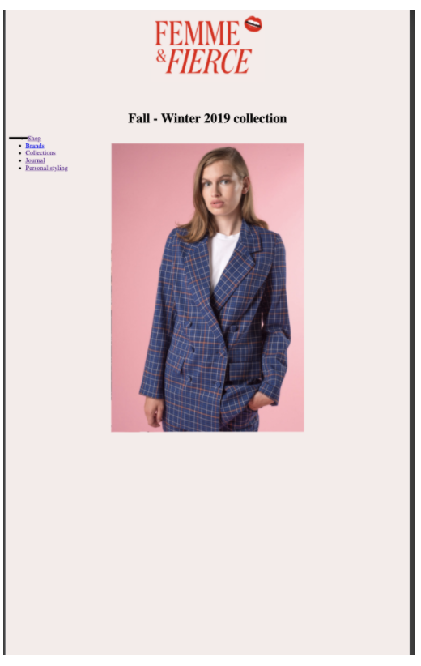

## Breakdownschets (week 1)

## Intake (week 1)
-uitwerken voor de kick-off werkgroep - begin van de eerste week-

**Je startniveau:** Blauwe piste

**Je focus:** Ik ga me bezig houden met extra aandacht voor de surface plane.

**Je opdracht:** https://femmeandfierce.nl ( ik ga de website na maken.)

**Screenshot(s) van de eerste pagina (small screen):**

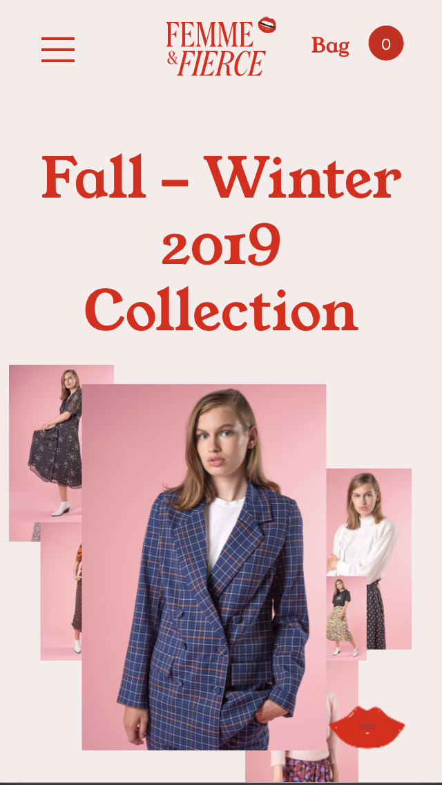

**Screenshot(s) van de tweede pagina (small screen):**

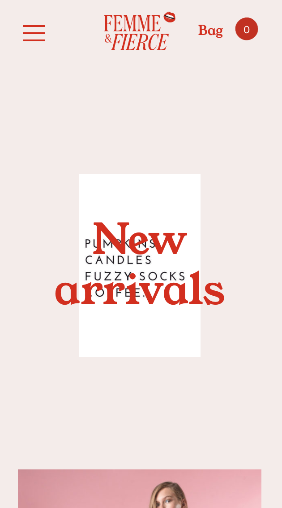
