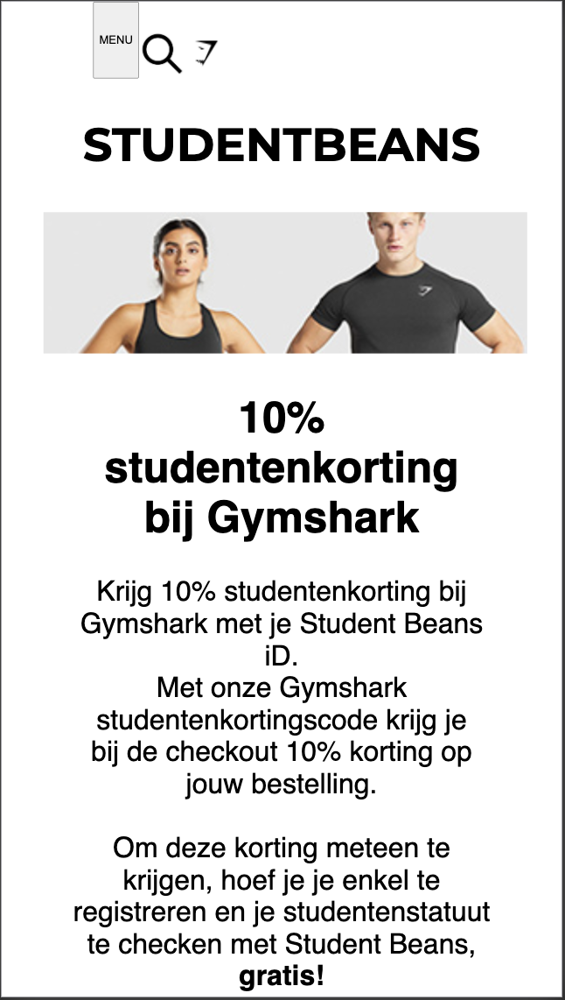

# Procesverslag
**Auteur:** -jouw naam-

Markdown cheat cheet: [Hulp bij het schrijven van Markdown](https://github.com/adam-p/markdown-here/wiki/Markdown-Cheatsheet). Nb. de standaardstructuur en de spartaanse opmaak zijn helemaal prima. Het gaat om de inhoud van je procesverslag. Besteedt de tijd voor pracht en praal aan je website.

## Bronnenlijst
1. -bron 1-
2. -bron 2-
3. -...-

## Eindgesprek (week 7/8)

-dit ging goed & dit was lastig-

**Screenshot(s):**

bloed zweet en tranen maar dan heb je ook wel wat. disclaimer: lichtblauwe piste (heel lichtblauw) ik heb hier echt een meesterwerk neergezet voor mijn gevoel..
hamburgermenu helaas nog steeds niet gelukt. verder ben ik aardig ver gekomen :)

## Voortgang 3 (week 6)

In deze week heb ik samen met de docent besloten om over te stappen naar een andere site. Ik heb geen screenshots van het verloop want had nog maar twee weken de tijd om het in elkaar te zetten. niet aan gedacht dus excuse me

## Voortgang 2 (week 5)

Het ging nog steeds erg moeizaam. ik deed er echt mega lang over om een foto op de juiste plek te zetten..

## Voortgang 1 (week 3)

### Stand van zaken

Hamburger menu lukte me echt niet. was er zo lang mee bezig dat ik heb opgegeven en verder. nog niet zo veel heb gedaan

**Screenshot(s):**

### Agenda voor meeting

-samen met je groepje opstellen-

| student 1      | student 2          | student 3    | student 4        |
| ---            | ---                | ---          | ---              |
| dit bespreken  | en dit             | en ik dit    | en dan ik dat    |
| an dat ook nog | dit als er tijd is | nog een punt | dit wil ik zeker |
| ...            | ...                | ...          | ...              |

niet gedaan -:(

### Verslag van meeting

niet gedaan

## Breakdownschets (week 1)

## Intake (week 1)
-uitwerken voor de kick-off werkgroep - begin van de eerste week-

**Je startniveau:** Blauwe piste

**Je focus:** Ik ga me bezig houden met extra aandacht voor de surface plane.

**Je opdracht:** https://femmeandfierce.nl ( ik ga de website na maken.)

**Screenshot(s) van de eerste pagina (small screen):**

**Screenshot(s) van de tweede pagina (small screen):**

